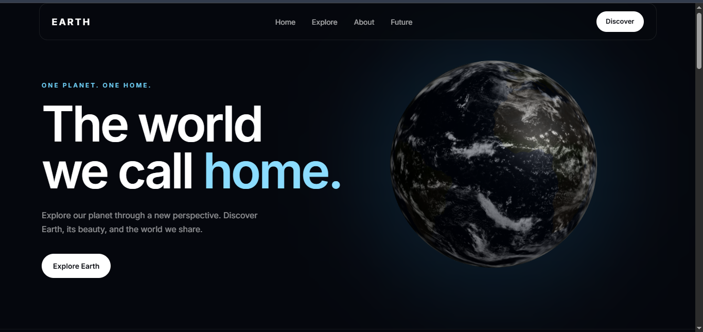
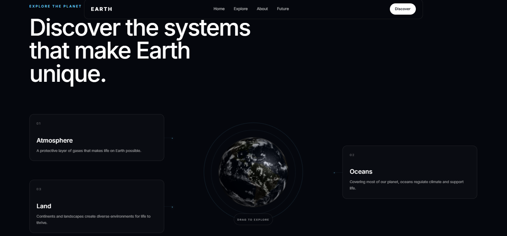
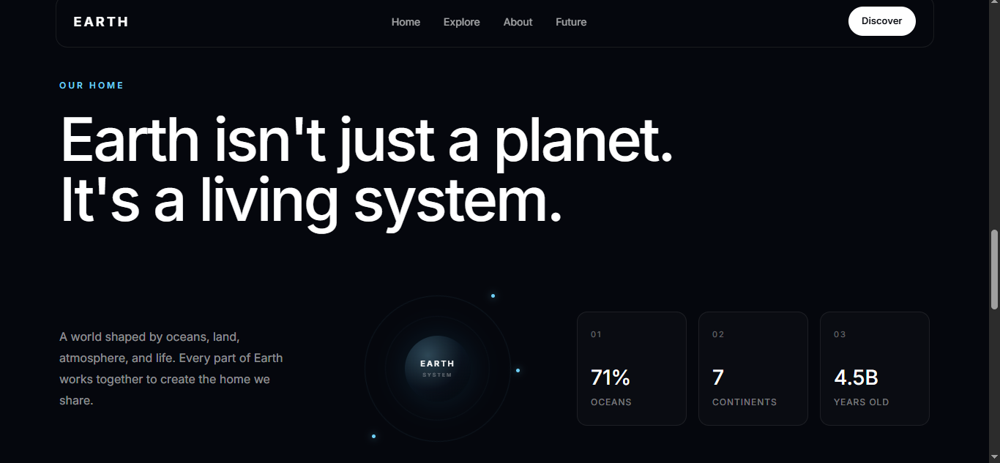
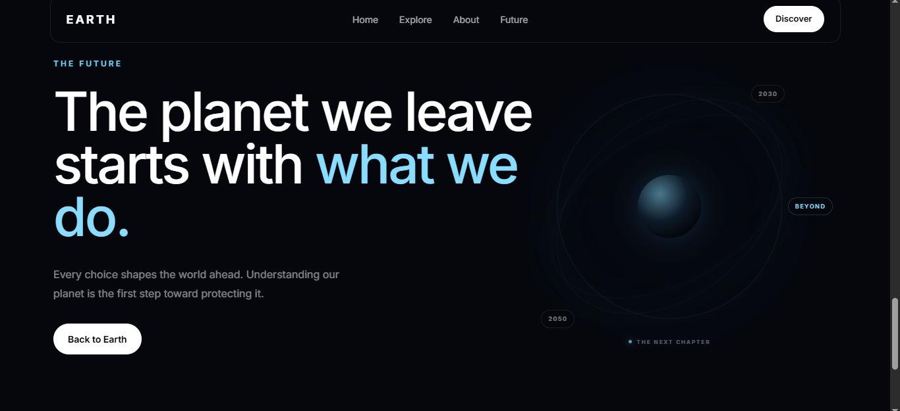
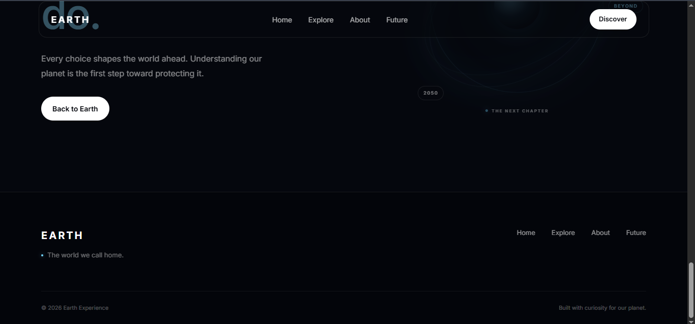
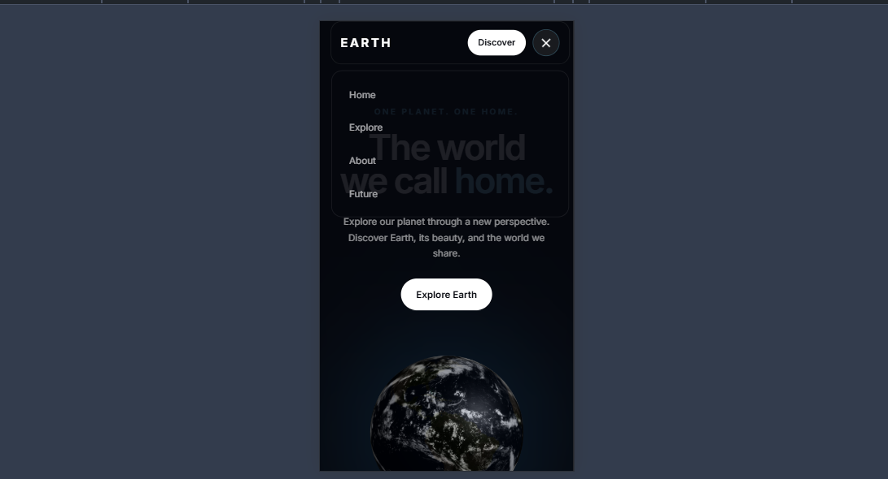

# 🌍 Earth Experience

A modern, immersive website built around the idea of exploring and understanding our planet.

The project combines a minimal dark visual design with an interactive 3D Earth model to create a cinematic and engaging browsing experience.

## ✨ Features

- Interactive 3D Earth model
- Drag-to-rotate Earth interaction
- Automatic Earth rotation
- Responsive design for desktop, tablet, and mobile
- Modern glassmorphism-inspired navigation
- Hero section with 3D visual integration
- Explore section highlighting Earth's major systems
- About section with key Earth statistics
- Future-focused visual timeline
- Smooth scrolling navigation
- Hover interactions and subtle animations
- Responsive mobile navigation menu
- Keyboard-visible focus states for improved accessibility

## 🪐 3D Asset Integration

The Earth 3D model used in this project was sourced from the **Algoryx Community** platform.

The asset was integrated into the website using **React Three Fiber**, **Three.js**, and **@react-three/drei**.

Custom presentation and interaction were implemented through:

- Three.js lighting
- Camera configuration
- Model scaling
- Continuous rotation
- Interactive drag controls
- Responsive canvas sizing
- Controlled device pixel ratio

The 3D asset is used as a central part of the website experience rather than being displayed as a standalone model.

### 3D Asset Attribution

The Earth 3D model was sourced from the Algoryx Community platform and integrated into this project as part of the interactive website experience.

## 🛠️ Tech Stack

### Frontend

- React
- Vite
- JavaScript
- CSS

### 3D

- Three.js
- React Three Fiber
- @react-three/drei
- GLB 3D model

### Development Tools

- ESLint
- Git
- GitHub

## 📁 Project Structure

```text
earth-experience/
│
├── public/
│   └── earth.glb
│
├── src/
│   ├── components/
│   │   ├── Navbar/
│   │   │   ├── Navbar.jsx
│   │   │   └── Navbar.css
│   │   │
│   │   ├── Hero/
│   │   │   ├── Hero.jsx
│   │   │   ├── Hero.css
│   │   │   ├── EarthModel.jsx
│   │   │   └── EarthModel.css
│   │   │
│   │   ├── Explore/
│   │   │   ├── Explore.jsx
│   │   │   └── Explore.css
│   │   │
│   │   ├── About/
│   │   │   ├── About.jsx
│   │   │   └── About.css
│   │   │
│   │   ├── Future/
│   │   │   ├── Future.jsx
│   │   │   └── Future.css
│   │   │
│   │   └── Footer/
│   │       ├── Footer.jsx
│   │       └── Footer.css
│   │
│   ├── App.jsx
│   ├── App.css
│   ├── index.css
│   └── main.jsx
│
├── package.json
├── vite.config.js
└── README.md
```

## 🚀 Getting Started

### 1. Clone the repository

```bash
git clone YOUR_GITHUB_REPOSITORY_URL
```

### 2. Navigate to the project

```bash
cd earth-experience
```

### 3. Install dependencies

```bash
npm install
```

### 4. Start the development server

```bash
npm run dev
```

The application will be available at the local development URL provided by Vite.

## 📦 Production Build

To create a production build:

```bash
npm run build
```

To preview the production build locally:

```bash
npm run preview
```

## ⚡ Performance

The project uses several techniques to keep the interactive 3D experience efficient:

- Controlled device pixel ratio for the 3D canvas
- Reusable React component architecture for 3D integration
- Disabled camera zoom and pan where unnecessary
- Lightweight CSS animations
- Responsive canvas sizing
- Production build optimization through Vite

Three.js and React Three Fiber naturally contribute to a larger JavaScript bundle because of the 3D rendering functionality.

## 📱 Responsive Design

The website was designed with responsive layouts for:

- Desktop
- Tablet
- Mobile

Responsive behavior adapts:

- Navigation
- Typography
- Content spacing
- 3D Earth positioning and sizing
- Cards and statistics
- Future visualization
- Footer layout

## ♿ Accessibility

Accessibility considerations include:

- Semantic HTML sections
- Visible keyboard focus states
- Accessible mobile navigation labeling
- Standard interactive links and buttons
- Clear visual hierarchy

## 🎨 Design Concept

The visual direction is inspired by the relationship between technology and our planet.

The dark interface represents space, while subtle cyan highlights represent atmosphere, energy, and the Earth itself.

The website follows a minimal visual language with:

- Dark backgrounds
- Soft cyan accents
- Glass-like surfaces
- Large editorial typography
- Subtle orbital animations
- Interactive 3D elements

## 🌎 Sections

### Hero

Introduces Earth as the central visual focus through an interactive 3D model, combining automatic rotation with user-controlled interaction.

### Explore

Presents Earth's major systems through interactive cards and connects the information architecture with the central Earth visualization.

### About

Provides a concise overview of Earth as a connected living system along with key planetary statistics.

### Future

Uses an orbital-inspired visualization and timeline markers to represent humanity's relationship with Earth's future.

### Footer

Provides navigation, project information, and closing content.

## 🔗 Links

**Live Website:**  
https://deluxe-starlight-57374d.netlify.app/

**GitHub Repository:**  
https://github.com/tamrakardevanshi-source/orbit.earth

## 📸 Screenshots

### 🖥️ Desktop Experience

#### Hero



#### Explore



#### About



#### Future



#### Footer



### 📱 Mobile Experience



## 📚 Learning Outcomes

Through this project, I gained practical experience in:

- Integrating external 3D assets into a React application
- Working with React Three Fiber and Three.js
- Building reusable React components
- Creating responsive layouts
- Designing interactive user interfaces
- Managing 3D camera and lighting
- Implementing interactive 3D controls
- Optimizing interactive rendering
- Structuring a production-oriented frontend project

## 👩‍💻 Author

**Devanshi Tamrakar**

B.Tech Information Technology
